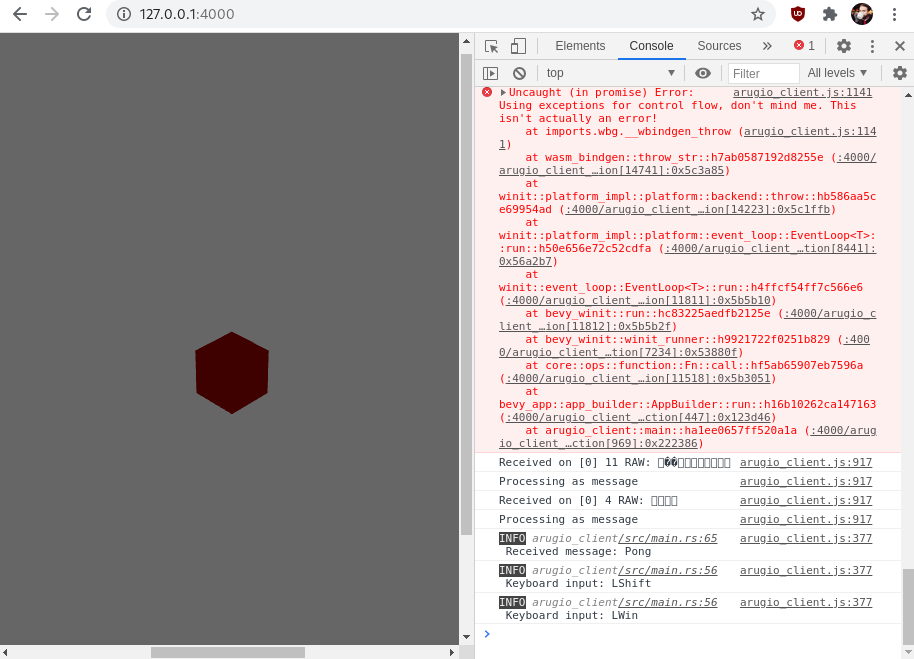

## ⚠️ this example is currently out of date. bevy_networking_turbulence is no longer maintained, so a rewrite with another network library is required. contributions welcome! 

# arugio
a bevy multiplayer browser game example



made possible with 
[bevy](https://github.com/bevyengine/bevy), 
[mrks-its/bevy_webgl2](https://github.com/mrk-its/bevy_webgl2)
 and 
[smokku/bevy_networking_turbulence](https://github.com/smokku/bevy_networking_turbulence)

## requirements
`cargo install wasm-bindgen-cli`

`cargo install basic-http-server`

## run server
```bash
cd arugio_server
cargo run --release
```

## run client
```bash
cd arugio_client
cargo build --release
cd ..
wasm-bindgen --no-typescript --out-dir dist --target web ./target/wasm32-unknown-unknown/release/arugio_client.wasm
basic-http-server dist
```
